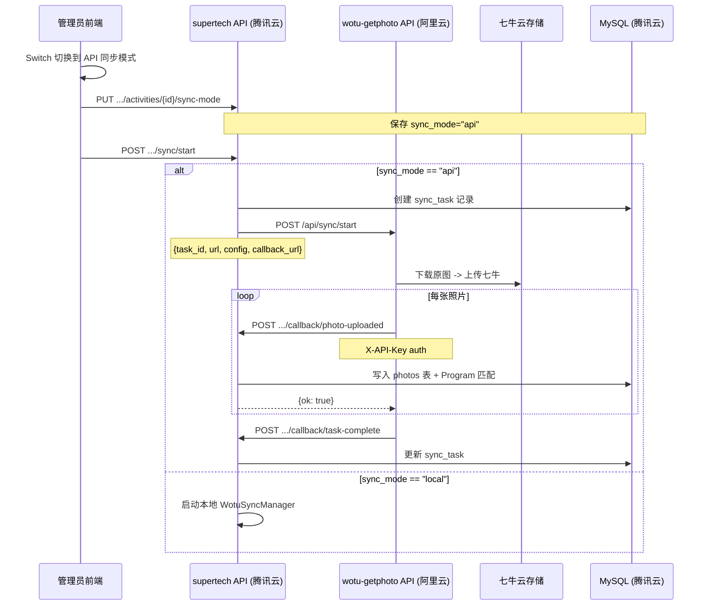

## 需求概述

在活动管理的"照片同步"Tab 中增加一个 Switch 开关，用于切换照片同步模式（本地同步 / API 远程同步）。

### 核心功能

1. **同步模式开关**：

- 在"喔图照片同步"卡片顶部添加 Switch 组件，标记为"同步模式"
- 开关两端标签：`本地同步` / `API同步`
- 开关状态持久化到数据库（在 Activity 表新增 `sync_mode` 字段）
- 开关状态通过 API 读取和保存

2. **本地同步模式（已有逻辑保持）**：

- 保留现有的完整同步流程
- 所有操作在本地进程中完成（WotuSyncManager）
- 现有 UI 行为完全不变

3. **API 同步模式（新增逻辑）**：

- 点击"开始同步"时，后端将请求转发到阿里云 wotu-getphoto-by-deepseek 服务
- wotu 服务负责：抓取喔图相册 -> 下载原图 -> 上传到七牛云
- 每上传完一张照片，wotu 回调 supertech API：`POST /api/admin/callback/photo-uploaded`
- 回调接口写入 photos 表 + Program 自动匹配（复用现有 `_save_photo_record` 逻辑）
- 任务完成后，wotu 回调：`POST /api/admin/callback/task-complete`
- API 同步模式下，前端的状态轮询/日志等通过回调缓存获取

### UI 变化

- 在卡片标题下方增加 Switch 开关行
- 开关切换时，API 同步模式下方显示提示信息说明流量走向
- 其余 UI 布局不变

### 非功能需求

- 回调接口需要 API Key 认证
- 回调接口设计为幂等（wotu_photo_id 去重）
- API 模式下的实时状态通过回调缓存获取
- 环境变量控制：WOTU_SERVICE_URL、WOTU_API_KEY

## 技术方案

### 技术栈

- **后端**：Python 3.11 + FastAPI + SQLAlchemy + MySQL（复用现有堆栈）
- **前端**：Vue 3 + Ant Design Vue（复用现有堆栈）
- **存储**：Activity 表新增 `sync_mode` 字段（"local"/"api"）
- **HTTP 客户端**：httpx（异步，已存在于 requirements.txt）

### 架构设计

#### 数据流



#### 模块划分

1. **Activity 模型**：新增 `sync_mode` 字段
2. **配置**：新增 `WOTU_SERVICE_URL`、`WOTU_API_KEY` 环境变量
3. **wotu_client.py（新建）**：封装对阿里云 wotu 服务的 HTTP 调用
4. **回调 API**：新增 3 个回调端点
5. **Sync 路由改造**：开始/停止/状态根据 sync_mode 分发
6. **前端**：ActivityPhotoSync.vue 增加 Switch 和模式切换逻辑

### 目录结构变更

```
server/app/
  api/wotu.py              # [MODIFY] 新增回调端点 + sync-mode API + sync 路由分发
  services/wotu_client.py  # [NEW]   封装对阿里云 wotu 服务的 HTTP 调用
  services/wotu_sync.py    # [MODIFY] 改造 _save_photo_record 为独立可用方法
  models/activity.py       # [MODIFY] 新增 sync_mode 字段
  config.py                # [MODIFY] 新增 WOTU_SERVICE_URL / WOTU_API_KEY
  main.py                  # [MODIFY] 新增 sync_mode 列迁移

web/src/
  views/admin/ActivityPhotoSync.vue  # [MODIFY] 增加 Switch 开关和模式切换
  api/admin.ts                       # [MODIFY] 新增 syncMode API + callback 类型定义
```

### 关键接口设计

```python
# ===== 回调 API（新增，无需认证，使用 API Key）=====

POST /api/admin/callback/photo-uploaded
X-API-Key: <WOTU_API_KEY>
Body: {
    "task_id": int,
    "activity_id": int,
    "wotu_photo_id": str,        # 去重 Key
    "filename": str,
    "storage_url": str,          # 七牛云 URL
    "wotu_url": str,
    "storage_provider": "qiniu",
    "shoot_time": str | None,
    "width": int | None,
    "height": int | None,
    "file_size": int | None,
    "wotu_category_id": str | None,
    "wotu_category_name": str | None
}
Response: {"ok": true, "photo_id": int | null}

POST /api/admin/callback/task-complete
X-API-Key: <WOTU_API_KEY>
Body: {
    "task_id": int,
    "status": "completed" | "failed" | "stopped",
    "total_found": int,
    "total_downloaded": int,
    "total_uploaded": int,
    "total_failed": int,
    "total_skipped": int,
    "total_bytes": int,
    "error_msg": str | None
}
Response: {"ok": true}

POST /api/admin/callback/task-progress
X-API-Key: <WOTU_API_KEY>
Body: {
    "task_id": int,
    "total_found": int,
    "total_downloaded": int,
    "total_uploaded": int,
    "speed": float,
    "current_tab": str
}
Response: {"ok": true}


# ===== sync-mode API（新增，管理端）=====

GET   /api/admin/sync/activities/{activity_id}/sync-mode
Response: {"sync_mode": "local" | "api"}

PUT   /api/admin/sync/activities/{activity_id}/sync-mode
Body: {"sync_mode": "local" | "api"}
Response: {"message": "ok"}


# ===== 现有 sync API 改造 =====

POST /api/admin/sync/start
  -> 读取 activity.sync_mode
  -> "local": 调用 wotu_sync_manager.start_sync() (现有逻辑)
  -> "api": 创建 SyncTask -> 调用 wotu_client.start_sync()

POST /api/admin/sync/stop
  -> "local": wotu_sync_manager.stop_sync()
  -> "api": 调用 wotu_client.stop_sync()

GET  /api/admin/sync/status
  -> "local": 从 wotu_sync_manager 读取
  -> "api": 从回调缓存字典读取
```

### 实现要点

1. **Activity 模型**：新增 `sync_mode: Mapped[str] = mapped_column(String(10), default="local")`，在 main.py 的 `_init_database()` 中增加 `_ensure_activity_sync_mode_column()` 列迁移

2. **回调认证**：在 `wotu.py` 中新增 `_verify_callback_key` 依赖项，校验 `X-API-Key` header 是否匹配 `settings.WOTU_API_KEY`。回调端点无需 JWT 认证。

3. **幂等性**：`callback/photo-uploaded` 内部先查询 `Photo.wotu_photo_id` 是否已存在，存在则直接返回 `{"ok": true, "photo_id": existing.id}`，不进重新写入。

4. **API 模式的状态缓存**：后端维护一个模块级字典 `_api_sync_cache: Dict[int, SyncProgress]`，key 为 task_id。`callback/task-progress` 更新缓存，`sync/status` 读取缓存。

5. **开始同步的分发逻辑**：

```python
@router.post("/sync/start")
def start_sync(...):
activity = require_activity_access(...)
if activity.sync_mode == "api":
# 创建 SyncTask 记录
task_id = _create_sync_task_record(...)
# 调用阿里云 wotu 服务
wotu_client.start_sync(task_id=task_id, url=..., config=...)
return {"message": "已委托阿里云服务同步", "task_id": task_id}
else:
# 本地同步（现有逻辑）
...
```

6. **前端的 Switch 行为**：

- `onMounted` 时请求 `GET .../sync-mode` 获取开关状态
- Switch 切换时调用 `PUT .../sync-mode` 持久化
- 切换模式时，统计卡片/日志区域内容清空
- API 模式时，"停止"按钮不可用（因为停止需要转发到阿里云，可后续实现）
- Switch 下方增加提示文字

### 性能与可靠性

- 回调接口是轻量级 DB 写入（无文件 I/O），响应时间 < 100ms
- 回调请求失败时，wotu 侧负责重试（指数退避 5s/30s/60s）
- 回调接口幂等设计确保重试安全
- API Key 认证 + IP 白名单双重安全保障

## UI 设计方案

保持与现有管理后台一致的 Ant Design Vue 风格，在现有 ActivityPhotoSync.vue 组件中新增 Switch 开关区域。

### 修改后的 UI 结构

```
┌─ 喔图照片同步 ─────────────────────────────────────────┐
│  同步模式: [ 本地同步 ] ------- [ API同步 ]              │
│                                                          │
│  (API 模式时显示以下蓝色提示)                             │
│  i 照片由阿里云服务器(200Mbps)抓取并转存七牛云，主服务器 │
│    零负荷，仅回调数据走 3Mbps 带宽(数据量极小)           │
│                                                          │
│  当前活动: [xxx]     喔图相册地址: [xxx]                 │
│  并发下载数 / API间隔 / 停止次数 / 同步范围              │
│  [获取相册信息]  [分类选择...]                           │
│  [开始同步] [停止] [刷新状态]                            │
│  照片统计卡片 / 进度条 / 照片列表 / 日志 (保持不变)      │
└──────────────────────────────────────────────────────────┘
```

### 实现方式

- 使用 `<a-switch>` 组件，定义 `checked-children="API同步"` 和 `un-checked-children="本地同步"`
- 使用 `<a-alert>` 组件显示 API 模式的提示信息（type="info"，可关闭），仅在 api 模式时显示
- 保持现有所有统计卡片、照片网格、日志面板完全不变