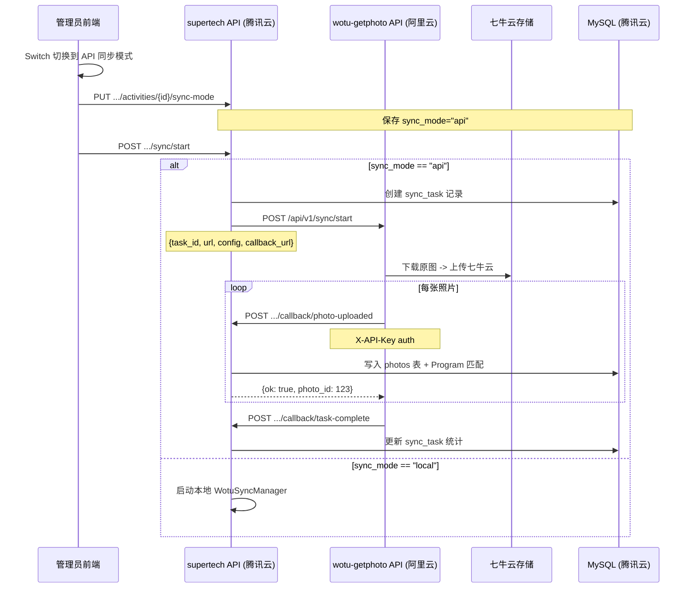

## 产品概述

在 supertech-program-manager 的活动管理"照片同步"tab 中实现以下功能：

### 同步模式

- 增加 Switch 开关，支持两种同步模式：**本地同步**（现有逻辑）和 **API同步**（新增）
- Switch 状态持久化到 Activity 表的 sync_mode 字段

### 本地同步模式（现有逻辑保持不变）

- 主项目直接启动 WotuSyncManager 在本地进程中完成全部同步
- 抓取喔图相册 -> 下载原图 -> 上传云存储 -> 写入数据库

### API 同步模式（新增）

- 主项目通过 HTTP 调用阿里云 wotu-getphoto-by-deepseek 服务开始同步
- wotu-getphoto-by-deepseek 负责：抓取喔图相册 -> 下载原图 -> 上传七牛云
- 每上传完一张照片，wotu-getphoto-by-deepseek 回调 supertech 的 callback API
- supertech 回调接口写入 photos 表 + Program 自动匹配
- 任务完成后 wotu-getphoto-by-deepseek 再次回调通知完成

### UI 调整

1. 卡片顶部增加 Switch 开关（本地同步/API同步），API 模式时显示蓝色提示信息
2. **去掉完成百分比显示**（移除 progress bar 及相关进度计算）
3. **去掉照片列表**（移除 photo-grid 区域）
4. **增加实时日志显示开关**，日志面板可展开/收起
5. 保留：统计卡片（发现/下载/上传/失败）、进度状态 tag、操作按钮

### wotu-getphoto-by-deepseek 项目 API 契约

- 需要明确定义该独立项目的 HTTP API 接口规范（本项目不自建，仅定义契约）

## 技术方案

### 技术栈

- **后端**：Python 3.11 + FastAPI + SQLAlchemy + MySQL（复用现有堆栈）
- **前端**：Vue 3 + Ant Design Vue（复用现有堆栈）
- **HTTP 客户端**：httpx（已存在于 requirements.txt）

### 架构设计

#### 整体交互流程



#### 两个项目之间的 API 契约

本计划明确定义 supertech-program-manager 与 wotu-getphoto-by-deepseek 之间的双向 API 接口。

##### A. wotu-getphoto-by-deepseek 需实现的 API（被 supertech 调用）

```
项目：wotu-getphoto-by-deepseek（阿里云部署）
基础路径：http://<阿里云服务器IP>:<port>/api/v1
```

**1. POST /api/v1/sync/start - 开始同步**

被 supertech 调用，启动一个新同步任务。

```
请求头：
  Content-Type: application/json

请求体：
{
  "task_id": 42,                    # supertech 创建的 sync_task ID
  "activity_id": 1,                 # 活动 ID
  "url": "https://m.alltuu.com/album/xxx",  # 喔图相册 URL
  "callback_url": "https://print.lurevan.com/api/admin/callback/photo-uploaded",
  "callback_complete_url": "https://print.lurevan.com/api/admin/callback/task-complete",
  "callback_progress_url": "https://print.lurevan.com/api/admin/callback/task-progress",
  "api_key": "xxxx",                # supertech 的 API Key
  "config": {
    "concurrency": 5,               # 并发下载数
    "scroll_delay": 5,              # API 轮询间隔（秒）
    "no_new_stop_rounds": 3,        # 30 秒无新自动停止次数
    "tab_mode": "current|all",      # 同步范围
    "selected_categories": [        # 选定分类（可选）
      {"category_id": "xxx", "name": "xxx", "sort": "4"}
    ]
  }
}

响应（同步）：
{
  "ok": true,
  "message": "task accepted"
}

响应（异步，建议）：
HTTP 202 Accepted
{
  "ok": true,
  "task_id": 42,
  "message": "task started"
}
```

**2. POST /api/v1/sync/stop - 停止同步**

```
请求体：
{
  "task_id": 42
}

响应：
{
  "ok": true,
  "message": "stop requested"
}
```

**3. GET /api/v1/sync/status?task_id=42 - 查询同步状态**

```
响应：
{
  "task_id": 42,
  "running": true,
  "phase": "scraping|downloading|uploading|completed|error|stopped",
  "total_found": 100,
  "total_downloaded": 50,
  "total_uploaded": 48,
  "total_failed": 2,
  "total_skipped": 0,
  "total_bytes": 104857600,
  "speed": 5.2,
  "current_tab": "集体照",
  "error_msg": null
}
```

##### B. supertech 需实现的回调 API（被 wotu-getphoto-by-deepseek 调用）

```
项目：supertech-program-manager（腾讯云部署）
基础路径：https://print.lurevan.com/api/admin/callback
认证：X-API-Key header（与 WOTU_API_KEY 环境变量匹配）
```

**1. POST /api/admin/callback/photo-uploaded - 单张照片上传完成回调**

```
请求头：
  X-API-Key: <WOTU_API_KEY>

请求体：
{
  "task_id": 42,
  "activity_id": 1,
  "wotu_photo_id": "album_xxx_photo_123",
  "filename": "IMG_001.jpg",
  "storage_url": "https://cdn.qiniu.com/photos/1/2026-05-14/abc123.jpg",
  "wotu_url": "https://img.alltuu.com/xxx/IMG_001.jpg",
  "storage_provider": "qiniu",
  "shoot_time": "2026-05-14 10:30:00",
  "width": 4000,
  "height": 3000,
  "file_size": 5242880,
  "wotu_category_id": "cat_001",
  "wotu_category_name": "集体照"
}

响应（幂等，已存在则返回已有 photo_id）：
{
  "ok": true,
  "photo_id": 12345
}
```

**2. POST /api/admin/callback/task-complete - 任务完成回调**

```
请求头：
  X-API-Key: <WOTU_API_KEY>

请求体：
{
  "task_id": 42,
  "status": "completed|failed|stopped",
  "total_found": 100,
  "total_downloaded": 100,
  "total_uploaded": 98,
  "total_failed": 2,
  "total_skipped": 0,
  "total_bytes": 524288000,
  "error_msg": null
}

响应：
{
  "ok": true
}
```

**3. POST /api/admin/callback/task-progress - 进度更新回调（可选，用于实时展示）**

```
请求头：
  X-API-Key: <WOTU_API_KEY>

请求体：
{
  "task_id": 42,
  "total_found": 100,
  "total_downloaded": 50,
  "total_uploaded": 48,
  "total_failed": 2,
  "total_skipped": 0,
  "total_bytes": 251658240,
  "speed": 5.2,
  "current_tab": "集体照"
}

响应：
{
  "ok": true
}
```

#### 模块划分

1. **Activity 模型**：新增 `sync_mode` 字段（"local"/"api"）
2. **配置**：新增 `WOTU_SERVICE_URL`、`WOTU_API_KEY` 环境变量
3. **wotu_client.py（新建）**：封装对阿里云 wotu-getphoto-by-deepseek 服务的 HTTP 调用（start/stop/status）
4. **回调 API**：新增 3 个回调端点（含 API Key 认证）
5. **API 模式状态缓存**：模块级字典，回调写-状态读
6. **Sync 路由改造**：start/stop/status 根据 sync_mode 分发
7. **前端 UI**：Switch + 去掉进度条 + 去掉照片列表 + 日志开关

### 目录结构变更

```
server/app/
  api/wotu.py              # [MODIFY] 新增回调端点 + sync-mode API + sync 路由分发
  services/wotu_client.py  # [NEW]   封装对阿里云 wotu 服务的 HTTP 调用客户端
  services/wotu_sync.py    # [MODIFY] 将 _save_photo_record 抽取为独立函数（供回调使用）
  models/activity.py       # [MODIFY] 新增 sync_mode 字段
  config.py                # [MODIFY] 新增 WOTU_SERVICE_URL、WOTU_API_KEY
  main.py                  # [MODIFY] 新增 sync_mode 列迁移函数

web/src/
  views/admin/ActivityPhotoSync.vue  # [MODIFY] 增加 Switch、API提示、日志开关；移除进度条、照片列表
  api/admin.ts                       # [MODIFY] 新增 syncMode API 调用
```

### 关键实现要点

1. **Activity 模型**：新增 `sync_mode: Mapped[str] = mapped_column(String(10), default="local")`。在 `main.py` 的 `_init_database()` 中增加 `_ensure_activity_sync_mode_column()` 列迁移函数

2. **回调认证**：新增 `_verify_callback_key` 依赖（校验X-API-Key == settings.WOTU_API_KEY）。回调端点**不**使用 JWT 认证，而是 API Key 认证。

3. **幂等性**：`callback/photo-uploaded` 先根据 `wotu_photo_id` 查询是否已存在。存在则直接返回 `{"ok": true, "photo_id": existing.id}`，不再重复写入。

4. **_save_photo_record 抽取**：将 `WotuSyncManager._save_photo_record` 中的逻辑抽取为独立函数 `save_photo_record(db, photo_info, activity_id, storage_url, file_size)`，供回调接口和 WotuSyncManager 共用。

5. **API 模式状态缓存**：模块级字典 `_api_sync_cache: Dict[int, dict]`，key 为 task_id。`callback/task-progress` 更新缓存，`sync/status` 从缓存读取。

6. **wotu_client.py**：封装三个方法：

- `async def start_sync(task_id, activity_id, url, config, callback_urls)` -> 请求 wotu-getphoto `/api/v1/sync/start`
- `async def stop_sync(task_id)` -> 请求 `/api/v1/sync/stop`
- `async def get_status(task_id)` -> 请求 `/api/v1/sync/status`

7. **前端 UI 变更**：

- Switch 组件：`<a-switch checked-children="API同步" un-checked-children="本地同步">`
- API 模式提示：`<a-alert type="info" message="..." closable />`
- 移除：`<a-progress>` 组件及其 computed（progressPercent、progressStatus）
- 移除：照片网格区域（`.photo-grid`）
- 日志开关：使用 `<a-collapse>` 或自定义按钮切换日志面板的显示/隐藏，默认收起

### 性能与可靠性

- 回调接口是轻量级 DB 写入（无文件 I/O），响应时间 < 100ms
- wotu-getphoto-by-deepseek 侧负责重试（5s/30s/60s指数退避），回调接口幂等确保重试安全
- API Key 认证（回调接口）+ IP 白名单（Nginx层）双重保障
- 状态缓存使用普通 dict，不持久化，宕机后丢失的进度不影响同步结果（数据已写入DB）

## 设计说明

保持与现有管理后台一致的 Ant Design Vue 风格，在 ActivityPhotoSync.vue 组件中进行以下调整：

### 修改后的 UI 结构

```
┌─ 喔图照片同步 ──────────────────────────────────────────┐
│  同步模式: [ 本地同步 ] ------- [ API同步 ]                │
│                                                           │
│  (API 模式时显示蓝色 Alert 提示)                           │
│  i 照片由阿里云服务器(200Mbps)抓取并转存七牛云，主服务器  │
│    零负荷，仅回调数据走 3Mbps 带宽(数据量极小)             │
│                                                           │
│  当前活动: [xxx]     喔图相册地址: [xxx]                   │
│  并发下载数 / API间隔 / 停止次数 / 同步范围                │
│  [获取相册信息]  [分类选择...]                             │
│  [开始同步] [停止] [刷新状态]                              │
│                                                           │
│  发现照片:100  已下载:80  已上传:78  失败:2               │
│  [运行中] 当前分类：集体照  78/100                        │
│                                                           │
│  [v] 实时日志 (42条)  [清空]                               │
│  点击展开日志面板...                                       │
└───────────────────────────────────────────────────────────┘
```

### 变更说明

1. 顶部新增 Switch 行
2. 移除 progress bar（`<a-progress>` 组件及相关计算属性）
3. 移除 photo-grid 区域（包括整个照片卡片循环和空状态提示）
4. 增加日志显示开关（默认收起，点击展开显示日志面板）
5. 保留：统计卡片行、进度状态 tag、操作按钮

## Agent Extensions

### SubAgent

- **code-explorer**: 用于多文件跨目录的代码搜索和探索。在实施过程中，当需要查找特定模式或跨多个文件确认影响范围时，使用该子代理进行高效的代码探索。

### Skill

- **frontend-design**: 用于 ActivityPhotoSync.vue 的 UI 改造和美化。确保 Switch 开关样式流畅、日志展开动画平滑、API 模式提示信息视觉清晰，保持与现有管理后台风格一致。